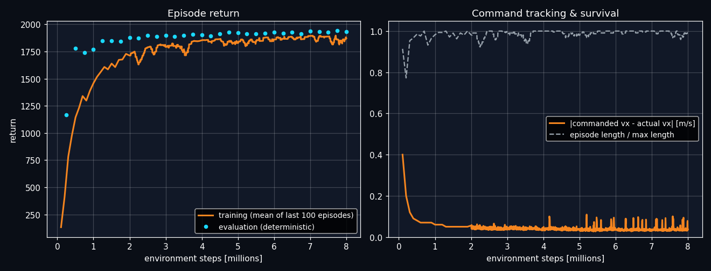
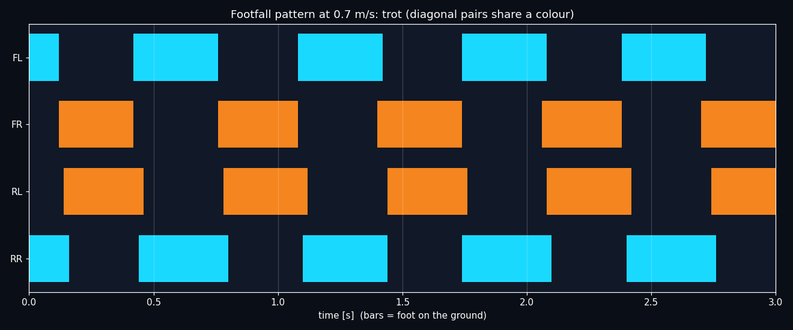

<div align="center">

# QuadBot RL Env

**A 12-DoF quadruped built from scratch, its Gymnasium environment, and the PPO policy that taught it to walk.**

No downloaded URDFs. No reference gaits. No motion capture.
The robot is generated in Python, the reward is 14 shaped terms, and the trot emerges on its own.

[](https://github.com/tathagata48/quadbot-rl-env/actions/workflows/ci.yml)
[](https://www.python.org/)
[](https://mujoco.org/)
[](https://gymnasium.farama.org/)
[](https://stable-baselines3.readthedocs.io/)
[](LICENSE)



</div>

---

## Table of contents

- [What this is](#what-this-is)
- [Results](#results)
- [Install](#install)
- [Use the pretrained policy](#use-the-pretrained-policy)
- [Train it yourself](#train-it-yourself)
- [Drive it with the keyboard](#drive-it-with-the-keyboard)
- [Interactive 3D view](#interactive-3d-view)
- [How it works](#how-it-works)
- [Repository layout](#repository-layout)
- [Reproducing the reference run](#reproducing-the-reference-run)
- [License](#license)

---

## What this is

A complete, self-contained legged-locomotion RL project — robot, environment, training, evaluation
and deployment — in about 3,000 lines of Python.

|  | |
|---|---|
| **The robot is generated, not downloaded** | `build_quadbot_xml()` emits MJCF from a `RobotSpec` dataclass: 11.3 kg total, 3 joints per leg, 0.2 m thigh and calf, PD position servos and foot touch sensors. Change a number, get a different robot. |
| **A real Gymnasium environment** | `QuadBot-v0` — 48-D observation, 12-D action, 50 Hz policy on 250 Hz physics, velocity-command tracking, `legged_gym`-style reward, optional domain randomisation. |
| **Trained end to end with PPO** | 8M environment steps across 16 parallel envs. Resumable, checkpointed, TensorBoard-logged. |
| **The gait was never specified** | Nothing in the reward mentions trotting. Diagonal-pair coordination is what PPO found on its own. |
| **Deployable without PyTorch** | The actor exports to a single `.npz` and runs on NumPy alone — matching SB3 to `6e-07` max absolute error. |

## Results

The reference run in [`runs/main/`](runs/main) — 8M steps, no domain randomisation, yaw commands within ±0.6 rad/s.
Evaluated with the deterministic policy over 6 × 20 s episodes:

| Commanded speed | Measured | Distance / episode | Falls |
|:---|:---|:---|:---|
| 0.4 m/s | **0.41 m/s** | 8.0 m | 0 |
| 0.7 m/s | **0.70 m/s** | 13.9 m | 0 |
| 1.0 m/s | **1.00 m/s** | 19.7 m | 0 |

Velocity tracking is within 2% across the whole trained command range, and the robot did not fall once.

### The emergent gait



At 0.7 m/s the policy settles into a clean **trot** — diagonal feet strike together, lateral pairs alternate:

| Metric | Value | Reading |
|:---|:---|:---|
| Diagonal feet in phase | **92%** of the time | FL+RR and FR+RL move as pairs |
| Diagonal contact correlation | **+0.84** | strongly synchronised |
| Lateral contact correlation | **−0.84** | strictly out of phase |
| Duty factor | **≈0.50** | each foot is down half the cycle |
| Stride rate | **1.5 strides/s** | |

That is the textbook definition of a trot, and no reward term asked for it.

## Install

Python 3.10 or newer.

```bash
git clone https://github.com/tathagata48/quadbot-rl-env.git
cd quadbot-rl-env
pip install -e ".[train,viz]"
```

To only *run* the pretrained policy, the core three are enough:

```bash
pip install "mujoco>=3.2" "gymnasium>=1.0" "numpy>=1.26"
```

> **Rendering backend.** The scripts default to headless EGL (`MUJOCO_GL=egl`), which is what you want on a
> server or in Colab. On a desktop with a display, use `MUJOCO_GL=glfw`. Stepping the physics needs neither.

## Use the pretrained policy

`NumpyPolicy` loads the exported actor with NumPy only — no PyTorch, no pickle, no version pinning:

```python
import gymnasium as gym
import quadbot                      # registers QuadBot-v0
from quadbot.policy import NumpyPolicy

policy = NumpyPolicy("runs/main/quadbot_policy.npz")
env = gym.make("QuadBot-v0", render_mode="human")

obs, _ = env.reset(options={"command": (0.7, 0.0, 0.3)})   # vx [m/s], vy [m/s], yaw rate [rad/s]
for _ in range(1000):
    obs, reward, terminated, truncated, info = env.step(policy(obs))
    if terminated or truncated:
        obs, _ = env.reset(options={"command": (0.7, 0.0, 0.3)})
```

Because the policy is just matrix multiplies and an ELU, this file is a reasonable starting point for
running the controller on real hardware.

## Train it yourself

```bash
# 8M steps, yaw commands up to 0.6 rad/s -- this reproduces runs/main
python train_run.py --steps 8000000 --yaw 0.6 --run-dir runs/my_run

# interrupted? pick up from the newest checkpoint
python train_run.py --steps 8000000 --yaw 0.6 --run-dir runs/my_run --resume

# export the .npz, evaluate, and render a demo MP4
python make_video.py --run-dir runs/my_run
```

Useful flags: `--envs` (parallel environments, default 16), `--dr` (domain randomisation:
friction, payload, motor strength and random pushes), `--eval-every`, `--checkpoint-every`, `--seed`.

Watch it learn:

```bash
tensorboard --logdir runs/my_run/tb
```

There is also [`QuadBot_RL_Colab.ipynb`](QuadBot_RL_Colab.ipynb) — the same pipeline as a single Colab
notebook, where a CPU runtime is enough. Regenerate it with `python build_notebook.py`.

## Drive it with the keyboard

`teleop.py` opens the MuJoCo viewer and puts you in command of the trained policy in real time:

```bash
export MUJOCO_GL=glfw          # needs a real display
python teleop.py --policy runs/main/quadbot_policy.npz
```

| Key | Action |
|:---|:---|
| <kbd>↑</kbd> <kbd>↓</kbd> | forward speed |
| <kbd>←</kbd> <kbd>→</kbd> | turn |
| <kbd>Space</kbd> | stop |
| <kbd>P</kbd> | shove it sideways, and watch it recover |
| <kbd>R</kbd> | reset |
| <kbd>Esc</kbd> | quit |

## Interactive 3D view

`sim_viewer` renders the simulation in the browser with three.js — live and steerable inside Colab,
or as a standalone replay page anywhere:

```python
from quadbot import QuadBotEnvConfig
from quadbot.sim_viewer import save_simulation_html, show_simulation

cfg = QuadBotEnvConfig(command_yaw_range=(-0.6, 0.6))   # the range the policy was trained on

show_simulation(policy, cfg)                            # inline in a notebook
save_simulation_html("quadbot_sim.html", policy, cfg)   # a self-contained page, with pause/scrub/slow-mo
```

## How it works

### The robot

Generated from `RobotSpec` — every dimension, mass, gain and joint limit is a field you can change.

| | |
|:---|:---|
| Mass | 11.3 kg total, 5.5 kg of it torso |
| Legs | 4 × 3 joints: abduction/adduction, hip, knee |
| Links | 0.2 m thigh, 0.2 m calf, 0.022 m foot radius |
| Actuation | PD position servos, `kp` 50, `kd` 1.5, 25–35 N·m limits |
| Sensing | base state + 4 foot touch sensors |

### The MDP

| | |
|:---|:---|
| **Action** (12) | joint-position offsets in [−1, 1], scaled by 0.3 rad and added to the nominal stance |
| **Observation** (48) | projected gravity (3), base linear velocity (3), base angular velocity (3), command (3), joint positions (12), joint velocities (12), previous action (12) — all body-frame |
| **Control rates** | policy at 50 Hz, physics at 250 Hz (`frame_skip` 5) |
| **Command** | vx ∈ [0.3, 1.0] m/s, yaw ∈ [−0.6, 0.6] rad/s, resampled every 10 s |
| **Termination** | torso contacts the ground, height below 0.16 m, or tilt beyond 60° |
| **Episode** | 1000 steps = 20 s |

### The reward

Two terms want forward progress; twelve keep it honest.

| Wants | Terms |
|:---|:---|
| **Track the command** | `tracking_lin_vel` +1.5, `tracking_ang_vel` +0.5 |
| **Stay level and tall** | `orientation` −5.0, `base_height` −30.0, `lin_vel_z` −2.0, `ang_vel_xy` −0.05 |
| **Step cleanly** | `feet_air_time` +1.0, `feet_slip` −0.1, `collision` −1.0 |
| **Move smoothly and cheaply** | `action_rate` −0.01, `torques` −1e-4, `dof_acc` −2.5e-7 |
| **Respect the hardware** | `dof_pos_limits` −10.0, `abad_deviation` −0.5 |

Tracking uses `exp(-error² / 0.25)`, and the total is clipped at zero so early exploration is never
punished into standing still.

### Training

PPO (Stable-Baselines3) with `VecNormalize` on observations and rewards.

| | | | |
|:---|:---|:---|:---|
| Steps | 8,000,000 | Network | 256 → 256 → 128 |
| Parallel envs | 16 | Learning rate | 3e-4 → 5e-5 (linear) |
| Rollout | 256 × 16 | Entropy coef | 0.002 |
| Batch / epochs | 1024 / 5 | Target KL | 0.03 |
| γ / λ | 0.99 / 0.95 | Clip range | 0.2 |

## Repository layout

```
quadbot-rl-env/
├── quadbot/
│   ├── robot.py         RobotSpec + build_quadbot_xml(): the MJCF generator
│   ├── env.py           QuadBotEnv / QuadBot-v0: observation, reward, termination
│   ├── training.py      PPO setup, resumable train(), .npz export, gait_analysis()
│   ├── policy.py        NumpyPolicy: the actor in ~40 lines of NumPy
│   ├── viz.py           HUD rollouts, MP4 writer, learning-curve and footfall plots
│   └── sim_viewer.py    three.js viewer -- live in Colab, replay anywhere
├── train_run.py         CLI: train (--steps, --envs, --yaw, --dr, --resume)
├── make_video.py        CLI: export, evaluate, render the demo MP4
├── teleop.py            keyboard control in the MuJoCo viewer
├── build_notebook.py    regenerates the Colab notebook
├── QuadBot_RL_Colab.ipynb
├── tests/               smoke tests: env contract + the policy still walks
└── runs/main/           the reference 8M-step run (see below)
```

### What is in `runs/main/`

| File | |
|:---|:---|
| `quadbot_policy.npz` | the exported actor — this is all you need to run the robot |
| `final_model.zip`, `best/best_model.zip` | SB3 checkpoints |
| `vecnormalize.pkl` | observation and reward normalisation statistics |
| `config.json` | every hyperparameter and robot dimension used |
| `results.json` | evaluation episodes, gait analysis, SB3-vs-NumPy agreement |
| `training_history.json`, `tb/` | full learning curves and TensorBoard logs |
| `learning_curves.png`, `footfall.png` | the plots on this page |

The run is committed deliberately: it makes every number above checkable without training anything.

## Reproducing the reference run

```bash
python train_run.py --steps 8000000 --yaw 0.6 --run-dir runs/main --seed 42
python make_video.py --run-dir runs/main
```

Roughly 8–12 hours on 16 CPU cores. `runs/main/config.json` records the exact configuration,
and the tests assert the shipped policy still holds 0.7 m/s for a full episode:

```bash
pytest -q
```

## License

[MIT](LICENSE) © Tathagata Chowdhury
